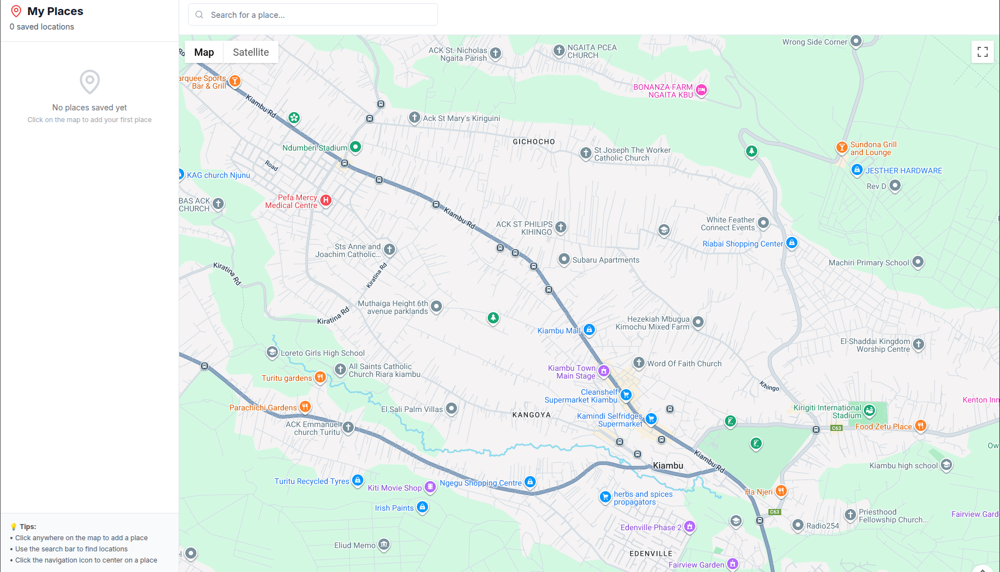

# My Places - Personal Location Saver

A web application that allows users to save and organize their favorite places using Google Maps integration.

## Features

✅ **Interactive Google Maps**

- Click anywhere on the map to add markers
- Pan and zoom functionality
- Custom red markers for saved places

📍 **Save Custom Places**

- Click on map to drop a marker
- Add custom names for each location
- Automatic coordinate capture

🔍 **Search Functionality**

- Google Places Autocomplete integration
- Search for any location worldwide
- Automatic map centering on search results

💾 **Local Storage Persistence**

- All saved places persist between sessions
- No account required - data stored locally
- Automatic save/load functionality

🗂️ **Organized Place Management**

- Sidebar showing all saved places
- Click any place to center map on it
- Delete unwanted places easily
- View coordinates and save dates

📱 **Responsive Design**

- Works on desktop and mobile devices
- Clean, intuitive interface
- Smooth animations and transitions

### UI Interface

### Demo Video

<iframe src="https://player.vimeo.com/video/1108479955" width="640" height="360" frameborder="0" allow="autoplay; fullscreen; picture-in-picture" allowfullscreen title="Demo Video"></iframe>

## Setup Instructions

### 1. Get Google Maps API Key

1. Go to the [Google Cloud Console](https://console.cloud.google.com/)
2. Create a new project or select an existing one
3. **Enable billing** (required even for free tier usage)
4. Enable the following APIs:
   - Maps JavaScript API
   - Places API
5. Create credentials (API Key)
6. (Optional) Restrict the API key to your domain for security

### 2. Environment Variables

Create a `.env.local` file in your project root:

\`\`\`
NEXT_PUBLIC_GOOGLE_MAPS_API_KEY=your_api_key_here
\`\`\`

**⚠️ Important Security Notes:**

- Never commit `.env.local` to version control
- The `.gitignore` file is configured to exclude environment files
- For production deployment, set environment variables in your hosting platform

### 3. Install and Run

\`\`\`bash
npm install
npm run dev
\`\`\`

## Deployment

### Vercel Deployment

1. Push your code to GitHub (`.env.local` will be ignored)
2. Connect your repository to Vercel
3. In Vercel dashboard, go to your project settings
4. Add environment variable:
   - Name: `NEXT_PUBLIC_GOOGLE_MAPS_API_KEY`
   - Value: Your Google Maps API key
5. Redeploy your application

### Other Platforms

For other hosting platforms, make sure to:

1. Set the `NEXT_PUBLIC_GOOGLE_MAPS_API_KEY` environment variable
2. Ensure your API key allows requests from your production domain
3. Consider adding domain restrictions to your API key for security

## Security Best Practices

### API Key Security

- **Domain Restrictions**: In production, restrict your API key to your specific domain
- **API Restrictions**: Limit the key to only Maps JavaScript API and Places API
- **Monitoring**: Set up billing alerts and monitor API usage
- **Rotation**: Regularly rotate your API keys

### Environment Variables

- Never hardcode API keys in your source code
- Use `.env.local` for local development
- Set environment variables in your hosting platform for production
- Different keys for development/staging/production environments

## How to Use

1. **Add a Place**: Click anywhere on the map, then enter a name for the location
2. **Search**: Use the search bar to find specific locations
3. **Navigate**: Click on any saved place in the sidebar to center the map
4. **Delete**: Use the trash icon next to any place to remove it
5. **View Details**: Click on map markers to see place information

## Tech Stack

- **Next.js 14** - React framework with App Router
- **TypeScript** - Type safety and better development experience
- **Tailwind CSS** - Utility-first CSS framework
- **Google Maps JavaScript API** - Interactive maps and places
- **Local Storage** - Client-side data persistence
- **Lucide React** - Beautiful icons

## Troubleshooting

### Common Issues

1. **"BillingNotEnabledMapError"**

   - Enable billing in Google Cloud Console
   - This is required even for free tier usage

2. **"This page can't load Google Maps correctly"**

   - Check that Maps JavaScript API and Places API are enabled
   - Verify your API key is correct
   - Ensure billing is enabled

3. **Search not working**

   - Make sure Places API is enabled
   - Check API key restrictions

4. **Map not loading**
   - Check browser console for specific error messages
   - Verify environment variable is set correctly
   - Try refreshing the page

### Getting Help

If you encounter issues:

1. Check the browser console for error messages
2. Verify your Google Cloud Console setup
3. Ensure all required APIs are enabled and billing is active
4. Check that your API key has the necessary permissions

## Project Structure

\`\`\`
my-places-app/
├── app/
│ ├── page.tsx # Main application component
│ ├── layout.tsx # Root layout
│ ├── env-setup.tsx # Environment setup warnings
│ └── globals.css # Global styles
├── components/
│ ├── map-component.tsx # Google Maps integration
│ ├── sidebar.tsx # Places list and management
│ ├── search-bar.tsx # Places search functionality
│ ├── save-place-modal.tsx # Modal for naming places
│ └── ui/ # Reusable UI components
├── hooks/
│ └── use-google-maps.ts # Google Maps loading hook
├── .env.local # Environment variables (not in git)
├── .gitignore # Git ignore rules
└── README.md
\`\`\`

## License

MIT License - feel free to use this project for learning and personal use.

## Contributing

This is a learning project, but feel free to fork and modify it for your own needs!
